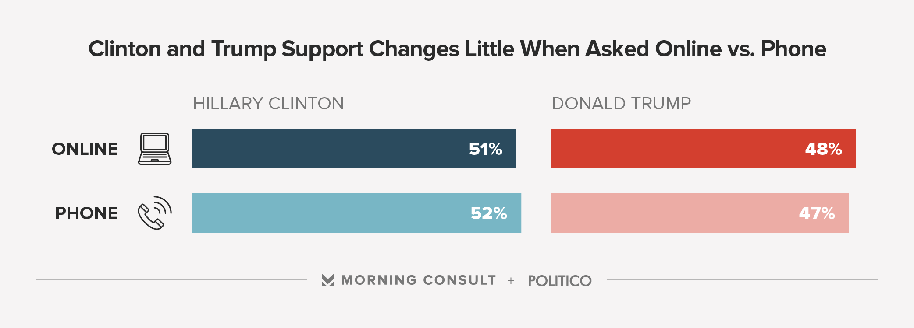
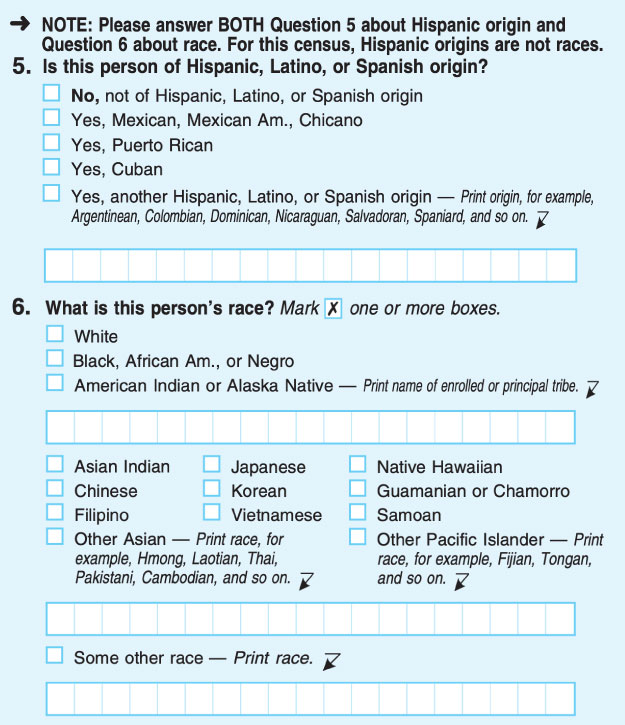
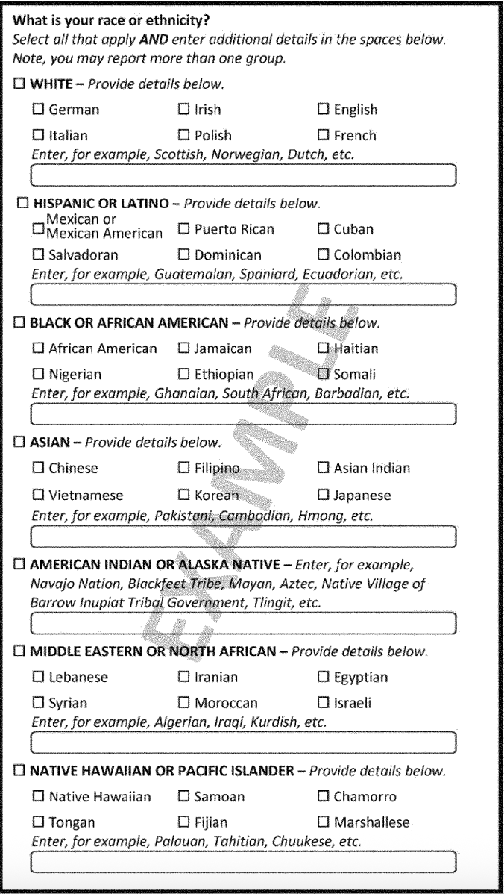
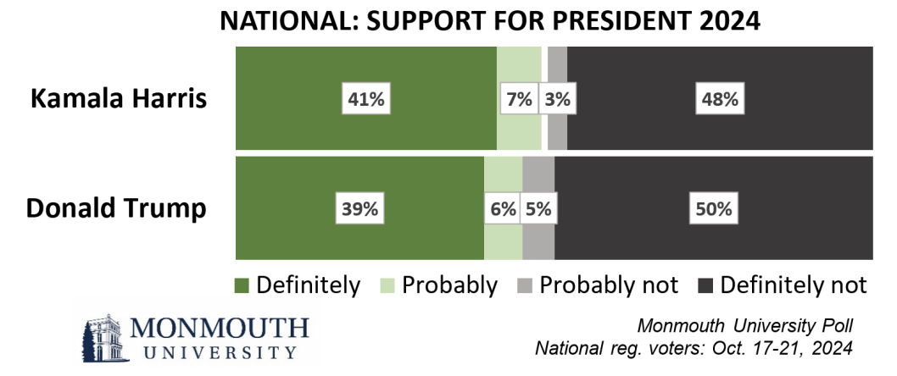

# Operationalization

## Introduction

One of the most cited articles in political science is by James Fearon and David Laitin [-@fearon2003] and concerns the causes of civil war. The authors argue that a country's vulnerability to insurgency^[Defined as "military conflict characterized by small, lightly armed bands practicing guerrilla warfare from rural base areas."] explains the likelihood that a country ends up in civil war. 

Let's put ourselves in the shoes of the authors. If we want to observe the correlation between civil wars and "vulnerability to insurgency," we need a quantifiable measure that we can use in our analysis. How do we find such a measure? Fearon and Laitin actually propose more than a dozen measures of "vulnerability to insurgency"! For now, let's focus on just one: the presence of rough terrain, which is important because rebels must be able to hide in order to avoid being destroyed by government forces.

Measuring rough terrain is more specific than vulnerability to insurgency, but the researcher must still make important choices. How "rough" must the ground be to qualify as rough terrain? Will we measure roughness in degrees (e.g., on a scale from 1-100) or as categories (flat, somewhat rough, or very rough)? What is the unit of geography for which we will measure roughness? If a town lies in a flat valley surrounded by rocky, steep hills, is that considered rough terrain?

Fearon and Laitin ultimately choose to measure rough terrain as the proportion of the country that is "mountainous," as determined by the geographer A.J. Gerard. Still, there are questions about Gerard's measure. When does a hill become a mountain (the subject of a 1995 film starring Hugh Grant, *The Englishman Who Went Up a Hill But Came down a Mountain*)? Does it matter if the mountain is accessible, with roads and trails, or covered in rocks and dense forest? Are mountain ranges better or worse for insurgency compared to mountains that stand alone?

I am picking on Fearon and Laitin a bit here, but in truth, it is often difficult to find good measures for the concepts in which we are interested when conducting data analysis. Researchers try to come up with measures that closely capture an abstract idea like rough terrain, but often we are just doing the best we can with the resources that we have. As long as we are transparent with our readers about our choices, we can generally accept the limitations of our measures and move on. This is exactly what Fearon and Laitin do in their famous article:

> "[Mountainous terrain] does not pick up other sorts of rough terrain that can be favorable to guerrillas such as swamps and jungle, and it takes no account of population distributions or food availability in relation to mountains; but it is the best we have been able to do."

This chapter is all about how to identify good measures for the concepts which we want to study given the real-world constraints that we face, a process that we call **operationalization**.

::: {.callout-note}
## Operationalization

The process of defining a measurable version of a concept.
:::

The bulk of this chapter will cover some guidelines that we can use when coming up with measures that can help you avoid common pitfalls in data analysis:

1. Measures should be unambiguous.
2. Measures should be parsimonious.
3. Measures should be accurate.
4. Measures should be reliable.
5. Measures should be feasible.

We will explore each of these recommendations in turn. However, our discussion will often revolve around the trade-offs that researchers must weigh when deciding on an operationalization. How can we develop an operationalization that is specific, but also simple? When can we be confident enough in the quality of the data we generate, given the practical challenges that we face in collecting that data? Operationalization is as much art as science, and we often [know a good measure when we see it](https://en.wikipedia.org/wiki/I_know_it_when_I_see_it). The goal of this chapter is to give you some tools to begin developing your own measures and evaluating the choices of others, and the more that you practice, the more confident you will become in creating good operationalizations.

## From Concept to Measurement

Identifying the best operationalization for a concept is somewhat subjective. Every possible operationalization has both pros and cons, and it is important to consider alternative measures before committing to any one approach. 

### Unambiguous

Our goal in selecting unambiguous operationalizations is to ease the collection, interpretation, and communication about our data. Ambiguous measures can cause us to imprecisely collect our data or make it difficult for others to understand the meaning of our data. Especially when we are measuring concepts which can take on different meanings across contexts, ensuring that our operationalization is unambiguous will avoid many of the pitfalls in research and communication that we will discuss later in this book.

Let's take an example from my own work. As a graduate student, I was interested in how Americans respond to cultural images around international trade, such as a weathered steelworker losing his job or a small business owner forced to close her store due to cheaper competition. In one part of my work, I explored whether politicians use these images in their television advertisements to signal to voters about their positions on international trade. I developed a codebook with several themes that I expected to see in the 800 or so Congressional campaign ads that I was examining. One of the themes was "anti-elite/Wall Street/big business," since corporate greed is sometimes blamed for the offshoring of jobs to regions with cheaper labor.

Below I've included two of the ads from my study, only one of which was coded as having the the "anti-elite/Wall Street/big business" theme. Can you guess which one it is?

[Monica Vernon - People](https://www.youtube.com/watch?v=CfkOOjolND0)

If you guessed number **1?**, you are correct! But it wouldn't surprise me if you struggled a bit to identify which ad qualified under the "anti-elite/Wall Street/big business" theme, since you did not have much information about the operationalization of this code. TK TK TK

To avoid this type of ambiguity, I used the following operationalization of the "anti-elite/Wall Street/big business" code:

> References to "the belief that [the working class] are on the losing end of an unfair game. Assessments of the rich as having more than they need or deserve, coupled with a concern that many suffer without what they need to survive" ([McDermott, Knowles, and Richeson 2019](https://doi.org/10.1111/asap.12188), 358). **Must be in direct reference to trade/outsourcing (e.g. a separate reference to tax rates for the rich would not count).**

Criticizing corporations or the wealthy is a common tactic by politicians who want to position themselves as populists. This poses a challenge for collecting my data, as well as for analyzing my results. Am I really capturing how politicians communicate about *trade* specifically if it is such a widely used trope in political advertisements? Knowing this, I proactively addressed this ambiguity in my codebook to focus my data collection on only the most relevant cases: references which are directly related trade or outsourcing. This allowed me to more accurately identify the frequency with which politicians use anti-elite imagery to communicate with voters about international trade.

How specific should we make our operationalizations in order to avoid ambiguity? Like many of the principles we will discuss in this book, the answer is more art than science, and involves tradeoffs with other considerations in designing good operationalizations. Use your knowledge of the subject matter to design the least ambiguous definition that still meets, as much as possible, our other goals for operationalization described below.

### Parsimonious

Parsimonious is the social scientific term for "simple" (how non-parsimonious of me to use the more complex word!) When deciding between two possible operationalizations, we should select the one that is simpler, all else equal. In practice, our choice between two measures is not entirely equal. Instead, we frequently make a decision based on the **parsimony-specificity trade-off**:

::: {.callout-note}
## Parsimony-Specificity Trade-off

In general, the more parsimonious a measure is, the less specific the measure is (and vice-versa).
:::

There is no ideal place on the parsimonious-specific spectrum where an operationalization should fall. Navigating this trade-off depends a lot on the researcher and their goals. Sometimes, we might prefer a measure that is more parsimonious than specific because we care that the measure be generalizable, or applicable to other cases. Other times, we might prefer a specific measure to a parsimonious one because we want to be highly attuned to a specific context or case.

For this reason, it is important not to settle on our first idea for an operationalization. We should consider at least a couple of alternative operationalizations, their pros and cons, and then select the measure that best fits our goals for our research. For example, let's say that you want to measure individuals' driving ability to see whether insurance rates fairly reflect insurers' risk. At first, you might operationalize driving ability as how many moving violations (tickets) a driver received in the past year. This is a fairly parsimonious measure, but it also lacks specificity. How many of the moving violations were for dangerous driving? Were the moving violations minor or serious?

So you try a more specific operationalization based on people's actual driving habits, such as how quickly they accelerate or brake, how sharply they turn, and whether they follow the speed limit. Some insurance companies [offer to monitor these metrics](https://www.statefarm.com/customer-care/download-mobile-apps/drive-safe-and-save-mobile) and potentially offer discounts to safer drivers. These operationalizations are highly specific, but not particularly parsimonious. How many different elements will you measure to form a proper indicator of driving ability? How will you weight the different elements to generate a numeric variable?

Like Goldilocks, you try one more operationalization: how many miles an individual drives each year. This is a fairly parsimonious measure, but it is also pretty specific. The more someone drives, the more likely they are to be in an accident and make a claim against their insurance. It is generalizable across different geographies, types of vehicles, and driving styles, but also speaks directly to the risk of insurers paying out claims.

One important point that I would like to make here is that parsimony is a means to an end, not an end in itself; that is, we aim for parsimonious measures because it makes our research easier to conduct, easier to understand, and easier to explain, not because parsimony is necessarily better than complexity. As Andrew Gelman, a highly influential statistical social scientist, [puts it](https://statmodeling.stat.columbia.edu/2004/12/10/against_parsimo/), "In practice, I often use simple models because they are less effort to fit and, especially, to understand. But I don't kid myself that they're better than more complicated efforts!"

### Accurate

Throughout this book, we will talk about many sources of error, and each type of error will be increasingly challenging to address. Fortunately, at the operationalization stage, the researcher still has nearly complete control, since ideally not a single data point has yet been collected. Therefore, we should almost always strive to eliminate **measurement error** from our data:

::: {.callout-note}
## Measurement Error

Measurement error occurs when the processes, procedures, or instruments used to collect data does not accurately generate the desired information.
:::

Obtaining accurate information is particularly challenging when working with social science data, because we rarely have an external standard against which to compare our measurements. If we are designing a new thermometer, we can validate that our instrument is accurate by comparing it's data to the temperature recorded by one or more other thermometers. However, as journalists and political professionals, we are often operationalizing concepts like beliefs, attitudes, and opinions for which the true value is not known.

We rely on our research subjects to provide us with accurate information about these highly subjective concepts, and most of the time, the data are *close enough* to the truth accept their validity. We accept that there will be some measurement error, but that the magnitude is sufficiently small as to be ignorable in most analyses. For example, you may recall that in the 2016 presidential election, there was some media discourse about the possibility of "shy Trump voters," who planned to vote for Donald Trump but would not admit this to a survey interviewer due to social desirability bias.^[Social desirability bias is the tendency of survey respondents to answer questions in ways that will be viewed favorably by others.] However, studies of the "shy Trump voter" theory fail to find any evidence that these respondents are hiding their true attitudes from interviewers. In one straightforward test, the pollster Morning Consult [compared support](https://morningconsult.com/2016/11/03/yes-shy-trump-voters-no-wont-swing-election/) for Hillary Clinton and Donald Trump among those who responded to a survey online and those who spoke to a live interviewer on the phone. They find no meaningful difference in support for the candidates between these two survey modes, even though the "shy Trump voter" theory would predict a greater impact from social desirability bias when speaking to a live interviewer.

{.lightbox width=70%}

Even though there is no source of truth against which we can evalute our measures of subjective attitudes, we can still use our knowledge about the subject matter to design more accurate instruments. For example, since 1970, the U.S. Census Bureau has asked separate questions about race and Hispanic or Latino ethnicity. However, many people of Hispanic or Latino descent responded to the race question by selecting "Some other race," leading to debate about whether Hispanic or Latino identity should be treated as a race. Today, U.S. government agencies are [instructed](https://www.federalregister.gov/d/2023-01635) to include Hispanic or Latino as a choice for race alongside other longstanding options. Moreover, until the 2000 Census, individuals could only select one race category to describe themselves, which ignored the possibility of multi-racial Americans. Respondents may now select as many race options as apply. As legal scholar Naomi Mezey said in a [*New York Times* review of the history of race on the U.S. Census](https://www.nytimes.com/interactive/2023/10/16/us/census-race-ethnicity.html?unlocked_article_code=1.PE8.m1k8.eo_nm_lPNbWw&smid=url-share), "It's like the census is adjusting the dials on your camera and you get different pictures accordingly." Finding the right settings on our data camera is critically important for generating accurate operationalization.

::: {layout-ncol=2}

:::

I also want to point out that the definition of measurement error is about the *information* produced using our data generating process, not the outcomes of our analysis. We can have an unambiguous, parsimonious, and accurate operationalization and yet still fail to find the patterns or relationships in the data that we expect. When we follow the scientific method, this will happen sometimes. Maybe our intuitions were wrong, or our data collection mechanism was flawed (the focus of the next chapter), or we just got unlucky. Good operationalization is a necessary, but not sufficient condition for a valid data analysis that allows us to uncover new facts about the world.

### Reliable

Reliability refers to the likelihood that, given the same conditions, our measure will record the same data in repeated trials. Getting the same result over and over again is distinct from accuracy, which has to do with whether the data we generate is close to the true value. Think about a broken clock stuck at 5:15 -- the clock's measurement of time is extremely reliable (it is always 5:15!) but only accurate twice per day.

Of course, our goal is to have measures that are both reliable *and* accurate, and in certain cases, reliability may be an imperative. When designing a diagnostic evaluation for a disease, we want each test to reliably generate a positive value if the disease is present and a negative value if the disease is not present. But as data analysts, we are often willing to sacrifice some reliability if the mean, or average, of our data samples is accurate, because we are not focusing on the results of individual tests. Instead, we are interested in the value across our entire **sample** or **population**.^[These terms are defined in CH. XX], ^[There are some exceptions, such as predicting vote behavior.] This is especially the case when working with attitudes, beliefs, and opinions where generating exactly the same conditions for data collection are nearly impossible. If I conduct a diagnostic medical test five minutes apart, it is very unlikely that the biology of the disease has changed during that time; on the other hand, if I ask your opinion about a hot-button political issue, even small changes in your thinking or mood could change your response between the two tests.

As an example, consider the Implicit Association Test (IAT), which measures the strength of subconscious associations between two groups (such as European Americans and African Americans) with subjective evaluations (such as good and bad). Participants are presented with images and words and asked to sort them into groups as quickly as they can. Based on how long it takes the participant to sort images and words representing the groups -- such as images of people's faces -- relative to a set of words (e.g., "grief" and "appealing"), we can identify implicit psychological associations between the groups and the evaluations. If you'd like, you can learn more about the IAT and take an IAT yourself at [Project Implicit's website](https://implicit.harvard.edu/implicit/takeatest.html).

The IAT has been used to evaluate the effect of implicit bias on voter behavior, candidate choice, race and immigration attitudes, partisan identity, and more. Despite its prominence, [meta-analyses of research using the IAT](https://doi.org/10.1146/annurev-psych-010419-050837) find that the test has only a moderate reliability, ^[Test-retest reliability estimates are unit-less, which makes interpreting the specific numeric estimate difficult.] which cautions us against drawing conclusions about a single individual's attitudes from just one test result. Implicit attitudes are a complex cognitive process, and the way that individuals respond to IAT tasks from moment to moment can vary dramatically. Yet, this level of reliability is widely considered sufficient for studies correlating IAT with other measures or comparing average results between two different groups.

The goal of reliability is not to create an operationalization that perfectly generates consistent data, but rather about maximizing our confidence that we are getting signals from our data and not just noise. Statistical estimates like Cronbach's alpha, Cohen's kappa, and Intraclass Correlation Coefficient can help us diagnose potentially unreliable measures, but more often we rely on our knowledge of the subject matter and the data generating process to assess the reliability of our operationalizations.

### Feasible

One of my favorite professors would ask us to design our research projects "as if money, time, and resources were no object." The idea is that freeing ourselves from logistical concerns allows the most important and critical ideas in our research design to surface, and then we can whittle down our ideal framework into one that is practical and reasonable. I've found this framework helpful again and again in my career, and that is why we discuss the feasibility the last quality of a good operationalization. We should focus on finding the best operarationalization that is unambiguous, parsimonious, accurate, and reliable, and only then turn to considerations of feasibility.

It is strictly necessary for a good operationalization that we can actually generate the data that we would like to collect. For example, I may believe that having my students write essays about the course material is the best way to evaluate their knowledge. However, if I am teaching a class of 350 students, I would not assign my students an essay because I cannot effectively grade that many responses. My operationalization of student knowledge is not a feasible one, and I will need to come up with an alternative measure, such as a multiple choice test or short answer questions. Nevertheless, knowing I would ideally assign my students an essay will help me design more feasible assessments that still measure the concepts in which I am interested, such as students' ability to find relationships between multiple topics or apply tools to novel cases.

When our ideal operationalization is not available to us, it may be possible to identify a *proxy measure*, a similar or related operationalization that captures enough of the same information as our ideal measure we can use our alternative measure as a substitute. We often use proxy measures when collecting data about attitudes or beliefs that individuals are unwilling or unable to reliably report themselves. Two heuristics that can be used to identify a proxy measure are if the operationalization is highly correlated with the ideal measure (such as assessing whether someone enjoys movies by asking if they watch the Oscars), or if the researcher combines a group of measures into a single numeric variable known as an **index (or scale) variable**:

::: {.callout-note}
## Index (or Scale) Variable

An index (or scale) variable is a type of proxy measure in which the researcher combines multiple sources of data into a single representation of the concept under investigation using a pre-defined mathematical operation.
:::

The fact that the index variable is generated though a pre-defined mathematical operation is important to avoid cherry-picking data to suit a particular statistical conclusion. The most common approach to designing index variables is to simply add up the individual elements of the index. Imagine that we want to measure a person's level of engagement with politics. We could ask individuals to self-report this information, but we would run into a couple of potential issues. First, survey respondents are likely to over-report their political engagement due to social desirability bias, so our measure will be inaccurate. Second, "political engagement" can mean different things to different people, which means that our measure will be unreliable. Instead, we could develop an index variable that adds up the number of political activities in which a person participates, such as:

* Voted in the most recent election
* Donated to a political candidate in the most recent election
* Volunteered for a political campaign in the most recent election
* Attended a political campaign event (e.g., rally, speech) in the most recent election
* Called or wrote to an elected representative in the past year
* Signed a petition in the past year
* Attended a protest in the past year
* Attended a government meeting (e.g., city council or school board) in the past year
* Wrote a letter to the editor of a newspaper in the past year

Respondents who respond "yes" to all of these activities would receive an index score of 9, while respondents who participated in none of these activities would have an index score of 0. Our hope is that because the questions are specific and objective, the results will be more accurate and reliable than if we had asked a single political engagement question directly.^[Respondents are known to over-report certain behaviors like voting, which could lead to an inaccurate index, but as just one element in a nine-part index, the effect of this inaccuracy will be relatively diluted.]

A more complex proxy measure might weight some elements of the index variable more heavily than others. Is volunteering for a political campaign more indicative of political engagement than signing a petition? Should attending a protest count more heavily than attending a government meeting? These are subjective decisions that the researcher needs to make based on their knowledge of the subject matter. For that reason, simple additive indices are generally preferred over more complex mathematical operations.

*include example of trust in government index from ANES*

## Summary

* bullet points go here

## Exercise

The Monmouth University Poll, one of the nation's preeminent national election pollsters, now asks survey respondents about [their probability of supporting each candidate](https://www.monmouth.edu/polling-institute/2022/11/14/2022-monmouth-university-poll-recap/) as separate questions rather than a single head-to-head question for each race. Patrick Murray, the Director of the Monmouth University Polling Institute, wrote that,

> "Horse race polls are not judged on the range of support shown for a candidate -- i.e., each candidate’s vote share plus or minus a margin of error -- but on assessing the size of the gap between the two candidates' shares. This obsession with \hspace{1em} "the gap" is fraught with potential error... This [change] gives a proxy for the horse race question while also providing another layer of understanding the campaign's dynamics -- specifically, how high or low is each candidate’s potential ceiling of support."

{.lightbox width=70%}

*Q goes here*
