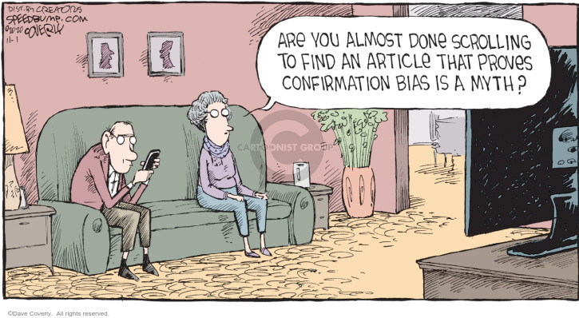
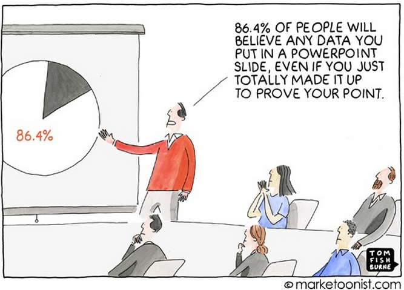
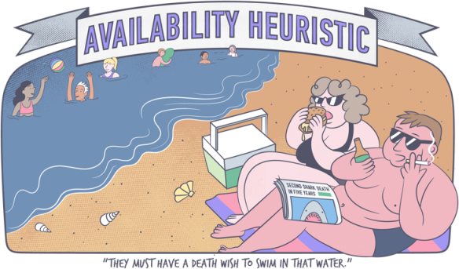

# Researcher Choices

## Introduction

>   SAM: On Monday, the OMB is putting out a new formula for calculating the poverty level.
>
    TOBY: I saw that. Does it need Presidential approval before it goes to Congress?
>
    SAM: Yeah.
>
    TOBY: What's the problem?
>
    SAM: It's a good news, bad news thing. Under the new formula, poverty is up 2 percent...
>
    TOBY: What does that shake out to?
>
    SAM: 4 million new poor people.
>    
    TOBY: ...4 million people became poor on the President's watch?
>
    SAM: They didn't become poor. They were poor already. And now we're calling them poor.

\- *The West Wing*, Season 3, Episode 7 ([link to video](https://www.youtube.com/watch?v=q9EehZlw-zk))

This part is about something called "researcher degrees of freedom." It consists of many parts:

In this book, we will focus only on the first X of these that have do with what we call the data generating process.

DEFINE DGP

Why? First, this isn't a book about statistics, and we're happy to point you in the right direction for that. But more importantly, because no amount of statistical wizardry can make up for bad data (garbage in = garbage out).

Before we get in to these researcher choices, we need to emphasize that data is generated *by humans*. Often, when researchers make mistakes, it's not intentional - we're just human (though there is an optional module in this section about famous cases of purposely fraudulent research.) We'll start our disucssion by covering just some of the most biases that affect researchers when designing data generating processes and analysis plans.

## Researcher Biases

### Confirmation Bias

{.lightbox width=60%}

### Desirability Bias

### Authority Bias

{.lightbox width=60%}

### Availability Bias

{.lightbox width=60%}

Any evidence that fear of plane crashes goes up when it's in the news?

What about that famous shark attacks article?

### Certainty Bias

